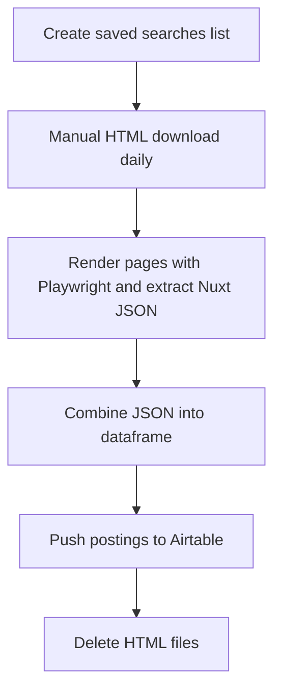
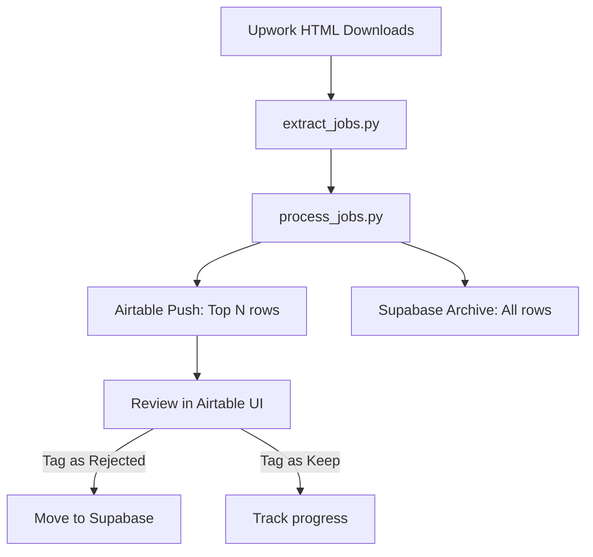

# 🕸️ Upwork Job Scraper ➜ Airtable Visual Dashboard

> **One‑click insight into the freelance projects that matter to me.**

---

## 🚀 Motivation & Objectives

* **Cut through noise & decision fatigue**: Upwork’s interface buries the gigs I actually care about; this project surfaces them instantly.
* **Respect Upwork ToS**: All HTML pages are **manually** downloaded—no automated scraping of the live site.
* **Centralised review**: Push cleaned job data to Airtable so I can tag, score, and track leads in one place.
* **Daily habit loop**: A lightweight workflow I can run every morning in under 5 minutes.

---

## 🔄 Proposed Workflow (Visual)





---

## 🗂️ Project & File Structure

```text
upwork_scraper_airtable/
├── environment.yml            # Conda environment spec
├── README.md                  # <- you are here
├── .gitignore                 # Exclude venv, data, secrets
├── data/
│   ├── raw_html/              # Manual downloads (HTML files)
│   └── processed/             # Extracted JSON & parquet/CSV
├── docs/
│   └── walkthrough.md         # Guide on how to use the tool
├── notebooks/                 # Exploration & visual checks
│   └── exploration.ipynb
├── src/
│   ├── __init__.py
│   ├── config.py              # Paths, Airtable keys (loaded from .env)
│   ├── extract_jobs.py        # Playwright + Nuxt JSON extractor
│   ├── process_jobs.py        # Combine & clean data
│   ├── airtable/
│   │   ├── __init__.py
│   │   ├── archive.py         # archives flagged records from Airtable
│   │   └── push.py            # Upload dataframe to Airtable
│   ├── supabase/
│   │   ├── __init__.py
│   │   └── push.py            # Upload dataframe to Supabase
│   └── utils/
│       ├── __init__.py
│       └── logger.py
└── tests/
    ├── test_extract.py
    └── test_process.py
```

---

## 🛠️ Tech Stack

| Layer            | Choice                             | Rationale                              |
| ---------------- | ---------------------------------- | -------------------------------------- |
| Language         | Python 3.11 (Conda)                | Familiar, rich scraping & data libs    |
| Headless browser | Playwright                         | Fast, modern, handles JS (Nuxt) pages  |
| Parsing          | `json`, `pandas`                   | Lightweight transform & analysis       |
| Storage          | Airtable (REST / `pyairtable`)     | No‑code visualisation & Kanban tagging |
| Archive Storage  | supabase                           | long term storage of job records       |
| Dev‑Ops          | GitHub + GitHub Actions (optional) | Version control & scheduled CI runs    |

---

## 🗓️ Project Plan (Milestones)

| Phase | Deliverable                               | Target Date |
| ----- | ----------------------------------------- | ----------- |
| 0     | Repo & Conda env initialised              |  T + 0 days |
| 1     | Manual download procedure documented      |  T + 1 day  |
| 2     | `extract_jobs.py` Playwright prototype    |  T + 3 days |
| 3     | Data merge & cleaning to single dataframe |  T + 5 days |
| 4     | Airtable schema & `push.py` integration   |  T + 6 days |
| 5     | Supabase schema & `push.py` integration   |  T + 7 days |
| 6     | Airtable archive workflow                 |  T + 8 days |
| 7     | End‑to‑end smoke test & logging           |  T + 9 days |
| 8     | README & wiki refinements                 |  T + 10 days |

---

## ✅ Todo Checklist

- [x] Initialise Git repo & push to GitHub
- [x] Create Conda environment (`environment.yml`)
- [x] Draft `.gitignore` & `.env.example`
- [ ] Document saved‑search URLs
- [x] Prototype `extract_jobs.py` with Playwright
- [x] Extract JSON and save per‑page files
- [x] Build `process_jobs.py` to combine JSON ➜ DataFrame
- [x] Design Airtable base & fields
- [x] Implement `airtable/push.py`
- [ ] Design Supabase base & fields
- [ ] Implement `supabase/push.py`
- [ ] Develop workflow and archive automations `airtable/archive.py`
- [ ] Write unit tests (`tests/`)
- [ ] Run first full workflow & verify Airtable rows
- [ ] Automate cleanup of HTML files
- [ ] Refine README, add screenshots, publish demo GIF

---

## ✨ Getting Started (Quick Run)

```bash
# 1. Clone and set up env
git clone https://github.com/<your‑user>/upwork_scraper_airtable.git
cd upwork_scraper_airtable
conda env create -f environment.yml
conda activate upwork-scraper

# 2. Place your downloaded HTML in data/raw_html/
# 3. Run extraction & push
python -m src.extract_jobs
python -m src.process_jobs
python -m src.airtable.push
```

> **Tip:** Add `AIRTABLE_API_KEY` and `AIRTABLE_BASE_ID` to your `.env` before pushing.

---

Happy scraping — and may your Upwork feed finally feel like **your** feed!


## High level operation data flows
- Local System
  - python scripts for
    - Generating & opening URLs
    - Extracting data from HTML downloads
    - Processing data
    - Uploading data to Supabase
    - Maintaining Airtable
- Upwork/WebScrapBook
  - Download HTMLs
- Airtable
  - Lead tracker for New and Shortlisted Jobs
  - Lead
    - Shortlisted > Proposal > Interview > Contract > Complete
    - Discarded
- Notion?
  - Deal tracker from proposal to deal
- Supabase
  - Long term storage
    - Scrape requests - records each html file (query) that is saved
      - Schema
        - Search ID
        - Query timestamp
        - Upload timestamp
        - Query
        - Page
        - filepath
        - processed
    - Jobs - record unique jobs
      - Schema As per JSON @/Users/jslade/Documents/GitHub/upwork_scraper/data/processed/combined.json
    - Search Results - records unique combination of Jobs and Search
      - Schema
        - SearchID
        - JobID
        - proposalsTier (Track the lifetime of a job on the platform and monitor proposals growth)

### Workflow
1. Generate & Open search URLS
2. Save pages using WebScrapBook
3. Process downloads - check searchID does not exist before proceeding
4. Extract & process jobs
5. Push jobs to supabase - UPSERT job_id, UPDATE search record with total jobs and new jobs
6. Refresh Airtable with Updated jobs, archive the triaged jobs