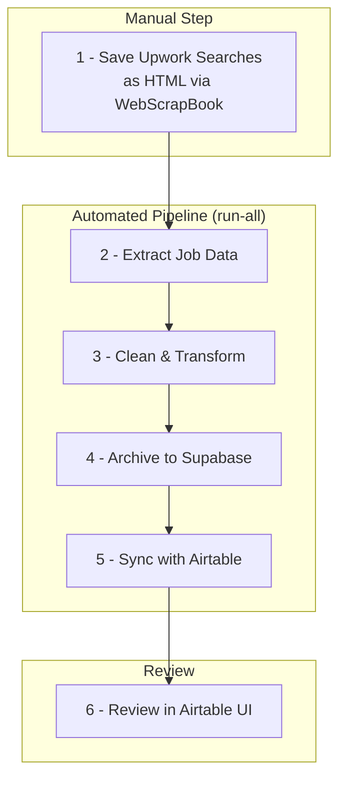

# 🕸️ Upwork Job Analysis ➜ Airtable Visual Dashboard

> **One‑click insight into the freelance projects that matter to me.**

This project provides a streamlined workflow to extract job postings from manually downloaded Upwork HTML files, process the data, and sync it with Airtable and Supabase for efficient review and tracking.

---

## 🚀 Motivation & Objectives

*   **Cut through noise & decision fatigue**: Upwork’s interface buries the gigs I actually care about; this project surfaces them instantly.
*   **Respect Upwork ToS**: All HTML pages are **manually** downloaded—no automated scraping of the live site.
*   **Centralised review**: Push cleaned job data to Airtable so I can tag, score, and track leads in one place.
*   **Daily habit loop**: A lightweight workflow I can run every morning in under 5 minutes.

---

## ⚙️ Project Flow

The project follows a two-part workflow: manual data capture followed by an automated processing pipeline.

1.  **Manual Data Capture**: The user manually saves Upwork job search results as complete HTML files using the **WebScrapBook** browser extension.
2.  **Automated Pipeline**: The `run-all` command executes a series of steps to extract, clean, store, and sync the data.

The diagram below illustrates the end-to-end process:



---

## 🏁 Quickstart Guide

Follow these steps to get the project running.

### 1. Initial Setup

1.  **Clone the Repository:**
    ```bash
    git clone https://github.com/<your-user>/upwork_scraper.git
    cd upwork_scraper
    ```

2.  **Create and Activate Conda Environment:**
    ```bash
    conda env create -f environment.yml
    conda activate upwork-scraper-env
    ```

3.  **Install Playwright Browsers:**
    ```bash
    playwright install
    ```

4.  **Configure Environment Variables:**
    Copy the example `.env.example` file to `.env` and fill in your credentials for Supabase and Airtable.
    ```bash
    cp .env.example .env
    ```

### 2. Daily Workflow

1.  **Download HTML Files:**
    Open your saved searches on Upwork and save the HTML files using the **WebScrapBook** browser extension. Files should be saved into a path similar to:
    `~/Downloads/WebScrapBook/Upwork/YYYY-MM-DD/`

2.  **Run the Pipeline:**
    Execute the main command to process the downloaded files, load the data into Supabase, and sync it with Airtable.
    ```bash
    python -m src.upwork_scraper.cli run-all
    ```
    Your Airtable dashboard will open automatically in your browser upon completion.

---

## 🛠️ Tech Stack

| Layer | Choice |
|---|---|
| Language | Python 3.11 (Conda) |
| Data Capture | WebScrapBook (Browser Extension) |
| Headless Automation | Playwright |
| Data Parsing | `json`, `pandas` |
| Data Storage | Postgres (via Supabase) |
| Frontend / UI | Airtable |

---

## 📚 Full Documentation

For detailed setup instructions, configuration options, CLI usage, and troubleshooting, please see the comprehensive **[Project Documentation](docs/PROJECT_DOCS.md)**.