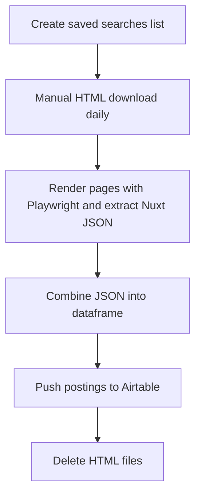
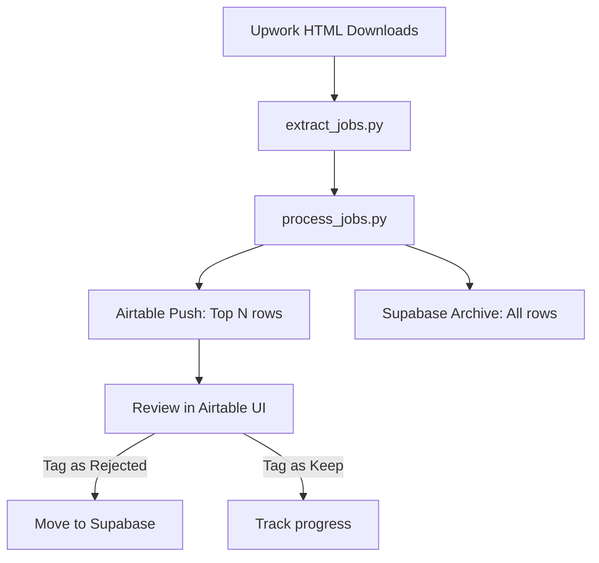

# 🕸️ Upwork Job Analysis ➜ Airtable Visual Dashboard

> **One‑click insight into the freelance projects that matter to me.**

---

## 🚀 Motivation & Objectives

* **Cut through noise & decision fatigue**: Upwork’s interface buries the gigs I actually care about; this project surfaces them instantly.
* **Respect Upwork ToS**: All HTML pages are **manually** downloaded—no automated scraping of the live site.
* **Centralised review**: Push cleaned job data to Airtable so I can tag, score, and track leads in one place.
* **Daily habit loop**: A lightweight workflow I can run every morning in under 5 minutes.

---

## 🔄 Proposed Workflow (Visual)





---

## 🗂️ Project & File Structure

The project is organized into a modular and scalable structure, separating concerns into logical components.

```
upwork_scraper/
├── .env.example             # Example environment variables file
├── .gitignore               # Git ignore rules
├── environment.yml          # Conda environment definition
├── pytest.ini               # Pytest configuration
├── README.md                # Project README
├── data/
│   ├── processed/           # Stores processed JSON job data
│   ├── raw_html/            # Stores manually downloaded raw HTML files
│   ├── temp/                # Temporary files (e.g., single HTML extraction output)
│   └── search_urls.yml      # YAML file for managing search URLs
├── database/
│   └── schemas/             # SQL schemas for database tables (e.g., Supabase)
│       ├── 01_create_scrape_requests_table.sql
│       ├── 02_create_jobs_table.sql
│       └── 03_create_search_results_table.sql
├── docs/
│   ├── walkthrough.md       # Original project walkthrough guide
│   └── PROJECT_DOCS.md      # This comprehensive documentation file
├── notebooks/
│   └── html_parsing_test.ipynb # Jupyter notebook for HTML parsing tests
├── src/
│   └── upwork_scraper/      # Main Python package for the application
│       ├── __init__.py      # Package initializer
│       ├── cli.py           # Central Command-Line Interface (CLI) entry point
│       ├── config.py        # Centralized application configuration and path constants
│       ├── scraping.py      # Functions for HTML parsing, job extraction, and URL handling
│       ├── processing.py    # Functions for data flattening, metadata parsing, and data preparation
│       ├── connectors/      # Sub-package for external service integrations
│       │   ├── __init__.py
│       │   ├── airtable.py  # Logic for Airtable API interactions (sync, push, update)
│       │   └── supabase.py  # Logic for Supabase API interactions (insert, update, push)
│       └── utils.py         # General utility functions (e.g., file cleanup)
└── tests/                   # Unit and integration tests
    ├── test_processing.py
    └── test_scraping.py
```

---

## 🛠️ Tech Stack

| Layer            | Choice                             | Rationale                              |
| ---------------- | ---------------------------------- | -------------------------------------- |
| Language         | Python 3.11 (Conda)                | Familiar, rich scraping & data libs    |
| Headless browser | Playwright                         | Fast, modern, handles JS (Nuxt) pages  |
| Parsing          | `json`, `pandas`                   | Lightweight transform & analysis       |
| Storage          | Airtable (REST / `pyairtable`)     | No‑code visualisation & Kanban tagging |
| Archive Storage  | supabase                           | long term storage of job records       |
| Dev‑Ops          | GitHub + GitHub Actions (optional) | Version control & scheduled CI runs    |

---

## 🗓️ Project Plan (Milestones)

| Phase | Deliverable                               | Target Date |
| ----- | ----------------------------------------- | ----------- |
| 0     | Repo & Conda env initialised              |  T + 0 days |
| 1     | Manual download procedure documented      |  T + 1 day  |
| 2     | `extract_jobs.py` Playwright prototype    |  T + 3 days |
| 3     | Data merge & cleaning to single dataframe |  T + 5 days |
| 4     | Airtable schema & `push.py` integration   |  T + 6 days |
| 5     | Supabase schema & `push.py` integration   |  T + 7 days |
| 6     | Airtable archive workflow                 |  T + 8 days |
| 7     | End‑to‑end smoke test & logging           |  T + 9 days |
| 8     | README & wiki refinements                 |  T + 10 days |

---

## ✅ Todo Checklist

- [x] Initialise Git repo & push to GitHub
- [x] Create Conda environment (`environment.yml`)
- [x] Draft `.gitignore` & `.env.example`
- [x] Document saved‑search URLs
- [x] Prototype `extract_jobs.py` with Playwright
- [x] Extract JSON and save per‑page files
- [x] Build `process_jobs.py` to combine JSON ➜ DataFrame
- [x] Design Airtable base & fields
- [x] Implement `airtable/push.py`
- [x] Design Supabase base & fields
- [x] Implement `supabase/push.py`
- [x] Develop workflow and archive automations `airtable/archive.py`
- [x] Write unit tests (`tests/`)
- [x] Run first full workflow & verify Airtable rows
- [x] Automate cleanup of HTML files
- [ ] Refine README, add screenshots, publish demo GIF

---

For comprehensive technical documentation and detailed walkthroughs, see [PROJECT_DOCS.md](docs/PROJECT_DOCS.md).

Happy scraping — and may your Upwork feed finally feel like **your** feed!


## High level operation data flows
- Local System
  - python scripts for
    - Generating & opening URLs
    - Extracting data from HTML downloads
    - Processing data
    - Uploading data to Supabase
    - Maintaining Airtable
- Upwork/WebScrapBook
  - Download HTMLs
- Airtable
  - Lead tracker for New and Shortlisted Jobs
  - Lead
    - Shortlisted > Proposal > Interview > Contract > Complete
    - Discarded
- Notion?
  - Deal tracker from proposal to deal
- Supabase
  - Long term storage
    - Scrape requests - records each html file (query) that is saved
      - Schema
        - Search ID
        - Query timestamp
        - Upload timestamp
        - Query
        - Page
        - filepath
        - processed
    - Jobs - record unique jobs
      - Schema As per JSON @/Users/jslade/Documents/GitHub/upwork_scraper/data/processed/combined.json
    - Search Results - records unique combination of Jobs and Search
      - Schema
        - SearchID
        - JobID
        - proposalsTier (Track the lifetime of a job on the platform and monitor proposals growth)

### Workflow
1. Generate & Open search URLS - not yet implemented
2. Save pages using WebScrapBook - done
3. Process downloads using main.py and push to supabase - done
  - extract_jobs from the html into json files
  - process_jobs to transform and load the data into supabase
4. Cleanup and load jobs into Airtable - TODO next
  - Query jobs in Airtable and fetch the airtable status for each job_id. Update airtable_status in supabase jobs schema
  - Flush all lead and discarded jobs from airtable
  - push top 50 jobs from supabase to airtable where Status is lead or blank based on priority logic to be defined.
